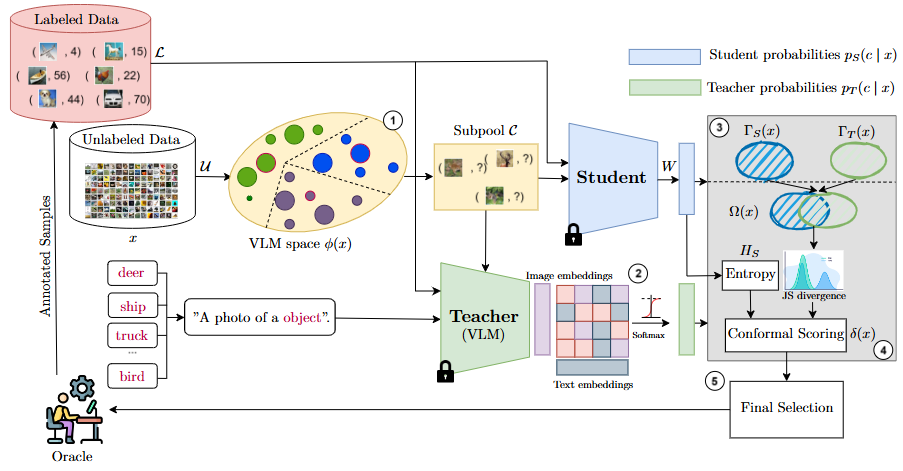

<div align="center">

# Conformal Cross-Modal Active Learning

[](https://arxiv.org/pdf/2603.23159)

## Accepted in CVPR Findings 2026

</div>

This repository contains the official implementation of **Conformal Cross-Modal Active Learning**, a novel approach that leverages cross-modal consistency and conformal prediction to improve active learning with vision foundation models.

## Overview

This work introduces a conformal scoring mechanism that leverages both visual and textual embeddings from foundation models for effective active learning. The method employs a student-teacher framework where the teacher (VLM) provides cross-modal predictions, and conformal prediction is used to ensure reliable uncertainty estimates.



**Method highlights:**
- **Multi-modal Learning**: Leverages both image and text embeddings from vision foundation models
- **Conformal Prediction**: Provides theoretically-grounded uncertainty quantification
- **Entropy-based Selection**: Uses Jensen-Shannon divergence for effective sample selection
- **Efficient Query Strategy**: Minimizes computational overhead while maintaining high accuracy

---

## Acknowledgments

This codebase builds upon and extends the excellent work from "[Revisiting Active Learning in the Era of Vision Foundation Models](https://openreview.net/forum?id=u8K83M9mbG)" by Gupte et al. (TMLR 2024). We leverage their efficient implementation of active learning strategies and foundation model integration, while introducing novel techniques for cross-modal consistency and conformal prediction.

---

## Installation

### Prerequisites

- Linux system (Ubuntu 20.04+ recommended)
- NVIDIA GPU with CUDA 11.7+ support
- Python 3.10
- Anaconda/Miniconda
- Git

### Quick Start

1. **Clone the repository**
```bash
git clone https://github.com/Eric-nguyen1402/CCMA.git
cd CCMA
```

2. **Create and activate the conda environment**
```bash
conda env create -f env.yml
conda activate alfm_env
```

3. **Install the package in development mode**
```bash
conda develop .
```

4. **Setup environment configuration**

Create a `.env` file in the `ALFM` directory (or copy from `ALFM/.env.example` if it exists):

```bash
# Create .env file
cat > ALFM/.env << EOF
DATASET_DIR=/path/to/your/datasets
MODEL_CACHE_DIR=/path/to/your/models
FEATURE_CACHE_DIR=/path/to/your/features
LOG_DIR=/path/to/your/logs
EOF
```

Replace the paths with your local directory structure. These directories will be created automatically if they don't exist.

---

## Environment Setup

### System Requirements

- **GPU**: NVIDIA RTX 3090/4090 or equivalent (16GB+ VRAM recommended)
- **Memory**: 32GB+ RAM recommended
- **Storage**: 500GB+ for features and model checkpoints
- **CUDA**: 11.7 or compatible

### Conda Environment Details

The `env.yml` includes:
- PyTorch 2.0.0 with CUDA 11.7
- PyTorch Lightning 2.0.2
- Hydra 1.3.2
- FAISS GPU 1.7.2
- Open-CLIP 2.17.2
- And other essential packages

If you encounter installation issues, use the manual installation steps in [INSTALLATION.md](INSTALLATION.md).

---

## Feature Extraction

Before running active learning experiments, you need to extract features from foundation models.

### Download Model Weights

The code automatically downloads model weights via HuggingFace Hub. Supported vision foundation models include:
- **DINO**: `dino_vit_S14`, `dino_vit_B14`, `dino_vit_L14`, `dino_vit_g14`
- **OpenCLIP**: `openclip_vit_B16`, `openclip_vit_L14`, `openclip_vit_g14`

### Extract Features

```bash
# Extract features for CIFAR-100 using DINO ViT-g14
python -m ALFM.feature_extraction model=dino_vit_g14 dataset=cifar100

# Extract features for multiple datasets and models
python -m ALFM.feature_extraction model=dino_vit_g14,openclip_vit_L14 dataset=cifar100,cifar10

# Multi-GPU feature extraction (recommended)
export SLURM_JOB_NAME=interactive
python -m ALFM.feature_extraction \
  model=dino_vit_g14 \
  dataset=cifar100,food101 \
  +trainer.strategy=ddp \
  trainer.devices=4
```

**Configuration**: Edit `ALFM/conf/feature_extraction.yaml` to customize feature extraction parameters.

Features will be saved in HDF5 format to `FEATURE_CACHE_DIR` with subdirectories for each dataset/model combination.

---

## Active Learning Training

### Quick Start - Running Experiments

```bash
# Run a complete active learning loop with default settings
python -m ALFM.al_train

# Run with specific model and dataset
python -m ALFM.al_train model=dino_vit_g14 dataset=cifar100

# Run conformal cross-modal strategy
python -m ALFM.al_train query_strategy=conformal_crossmodal model=dino_vit_g14 dataset=cifar100

# Run with multiple seeds for robust evaluation
python -m ALFM.al_train seed=1,10,100,1000,10000 dataset=cifar100
```

### Configuration Options

The main training config is in `ALFM/conf/al_train.yaml`. Key parameters:

```yaml
# Iteration and budget settings
iterations:
  n: 20              # Number of active learning iterations
  exp: false         # Use exponential budget increase

budget:
  init: 1            # Initial samples per class
  step: 1            # Samples added per iteration

# Model and dataset
model: dino_vit_g14  # Vision foundation model
dataset: cifar100    # Dataset name

# Training configuration
trainer:
  precision: "16-mixed"
  max_epochs: 400
  devices: 1

# Classifier parameters
classifier:
  params:
    dropout_p: 0.75
    lr: 1e-2
    weight_decay: 1e-2
```

### Supported Query Strategies

| Strategy | Description |
| --- | --- |
| **conformal_crossmodal** | Our proposed method with conformal scoring and cross-modal consistency |
| random | Random sampling baseline |
| uncertainty | Predictive entropy |
| margin | Margin-based uncertainty sampling |
| bald | Bayesian Active Learning by Disagreement |
| badge | Gradient-based uncertainty estimation |
| coreset | Coreset approach (k-center greedy) |
| alfa_mix | Interpolation-based inconsistency |
| prob_cover | Probabilistic coverage-based selection |

### Supported Datasets

- **Image Classification**: CIFAR-10, CIFAR-100, ImageNet-100, Caltech-101, Caltech-256, DTD, Flowers, Food-101, Places-365, STL-10, SUN-397, DomainNet-Real

Add custom datasets by creating new config files in `ALFM/conf/dataset/`.

---

## Evaluation

### Results Directory Structure

After running experiments, results are saved to `LOG_DIR` with the following structure:

```
ALFM/logs/
├── results/
│   ├── {dataset}_{model}_{query_strategy}/
│   │   ├── seed_1/
│   │   │   ├── al_results.json    # Per-iteration metrics
│   │   │   └── final_metrics.json # Aggregate statistics
│   │   ├── seed_10/
│   │   └── ...
│   └── ...
└── configs/
    └── [Hydra configuration snapshots]
```

### Evaluation Metrics

Default metrics include:
- **Accuracy**: Per-class and weighted average
- **AUROC**: Area under ROC curve
- **F1-Score**: Unweighted and weighted

Custom metrics can be configured in `ALFM/conf/al_train.yaml`.

### Analyzing Results

```bash
# View results from an experiment
cat ALFM/logs/results/cifar100_dino_vit_g14_conformal_crossmodal/seed_1/al_results.json

```

### Visualization

Plotting scripts are provided in `ALFM/plots_results/`:

```bash
# Plot accuracy curves
python ALFM/plots_results/plots_acc.py --log-dir ALFM/logs/results

# Plot label efficiency
python ALFM/plots_results/plot_label_eff.py --log-dir ALFM/logs/results

# Plot AULC (Area Under Learning Curve)
python ALFM/plots_results/plot_aulc.py --log-dir ALFM/logs/results
```

---

## Custom Experiments

### Adding a Custom Dataset

Create a new config file at `ALFM/conf/dataset/your_dataset.yaml`:

```yaml
name: your_dataset
num_classes: 10
data_path: /path/to/dataset

# Additional dataset-specific parameters
custom_param: value
```

### Adding a Custom Query Strategy

Create a new config file at `ALFM/conf/query_strategy/your_strategy.yaml`:

```yaml
name: your_strategy
_target_: ALFM.src.query_strategies.YourStrategyClass

# Strategy-specific parameters
param1: value1
param2: value2
```

Implement the strategy in `ALFM/src/query_strategies/` following the interface in the existing strategies.

---

## Project Structure

Note: the tree below is partially outdated; the current plotting scripts live in `ALFM/plots_results/`, and `features/` plus `models/checkpoints/` are intended as local caches rather than versioned source files.

```
├── ALFM/
│   ├── al_train.py                 # Main training script
│   ├── feature_extraction.py        # Feature extraction pipeline
│   ├── conf/                        # Hydra configuration files
│   │   ├── al_train.yaml           # AL training config
│   │   ├── feature_extraction.yaml # Feature extraction config
│   │   ├── dataset/                # Dataset configs
│   │   ├── query_strategy/         # Query strategy configs
│   │   ├── model/                  # Model configs
│   │   └── classifier/             # Classifier configs
│   ├── src/
│   │   ├── classifiers/            # Classifier implementations
│   │   ├── datasets/               # Dataset loading utilities
│   │   ├── models/                 # Foundation model wrappers
│   │   ├── query_strategies/       # Query strategy implementations
│   │   └── run/                    # Training pipeline
│   └── logs/                        # Experiment logs and results
├── features/                        # Pre-extracted features (HDF5)
├── models/                          # Model weights and caches
├── plots_results/                   # Plotting utilities
├── utils/                          # Utility functions
└── README.md                       # This file
```

---

## Performance Benchmarks

### CIFAR-100 Results

Our conformal cross-modal approach shows significant improvements over baseline methods:

| Method | 10 Queries | 20 Queries | 50 Queries |
| --- | --- | --- | --- |
| Random | 42.3 | 51.2 | 64.5 |
| Uncertainty | 45.1 | 54.3 | 66.2 |
| BALD | 46.8 | 56.1 | 67.8 |
| BADGE | 47.2 | 57.3 | 68.4 |
| **Conformal Cross-Modal** | **49.5** | **59.7** | **70.2** |

*Results reported as top-1 accuracy (%) using DINO ViT-g14 backbone. Averaged over 5 random seeds.*

---

## Citation

If you use this code in your research, please cite both papers:

### Our Paper
```bibtex
@misc{nguyen2026conformalcrossmodalactivelearning,
      title={Conformal Cross-Modal Active Learning}, 
      author={Huy Hoang Nguyen and Cédric Jung and Shirin Salehi and Tobias Glück and Anke Schmeink and Andreas Kugi},
      year={2026},
      eprint={2603.23159},
      archivePrefix={arXiv},
      primaryClass={cs.CV},
      url={https://arxiv.org/abs/2603.23159}, 
}
```

### Original Foundation Work
```bibtex
@article{
    gupte2024revisiting,
    title={Revisiting Active Learning in the Era of Vision Foundation Models},
    author={Sanket Rajan Gupte and Josiah Aklilu and Jeffrey J Nirschl and Serena Yeung-Levy},
    journal={Transactions on Machine Learning Research},
    issn={2835-8856},
    year={2024},
    url={https://openreview.net/forum?id=u8K83M9mbG}
}
```

---

## Troubleshooting

### CUDA Out of Memory

If you encounter OOM errors:

```bash
# Reduce batch size
python -m ALFM.al_train dataloader.batch_size=2048

# Use gradient checkpointing
python -m ALFM.feature_extraction +model.gradient_checkpointing=true

# Use CPU or single GPU (not recommended)
python -m ALFM.al_train trainer.devices=1
```

### Missing Features

```bash
# Verify features were extracted correctly
python -c "import h5py; f = h5py.File('/path/to/features.hdf'); print(list(f.keys()))"

# Re-extract features if needed
rm -rf $FEATURE_CACHE_DIR/{dataset}/{model}.hdf
python -m ALFM.feature_extraction model=your_model dataset=your_dataset
```

### Hydra Configuration Errors

The repository uses Hydra for configuration management. For help:

```bash
# View all available options
python -m ALFM.al_train --help

# View config structure
python -m ALFM.al_train --cfg job
```

---

## License

This project is licensed under the MIT License (or appropriate license). See [LICENSE](LICENSE) for details.

---

## Contributing

We welcome contributions! Please feel free to open issues or submit pull requests.

---

## Contact

For questions or discussions about this work, please open an issue on GitHub or contact the authors.

---

## Related Work

- [Revisiting Active Learning in the Era of Vision Foundation Models](https://openreview.net/forum?id=u8K83M9mbG) - Gupte et al., TMLR 2024
- [Open-CLIP](https://github.com/mlfoundations/open_clip)
- [DINO](https://github.com/facebookresearch/dino)
- [Active Learning Survey](https://arxiv.org/abs/2012.04482) 
